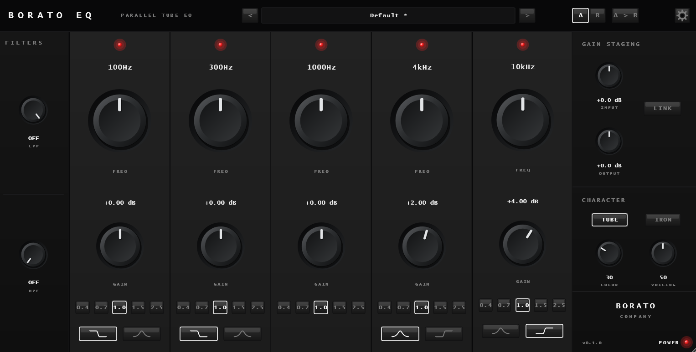

# BORATO EQ
**PARALLEL TUBE EQ**



**Manufacturer:** Borato Company  

**BORATO EQ** is a five-band parametric parallel tube EQ for mixing and mastering. 

Instead of running its bands one after another, all five bands work on the same input signal at once and blend back together, inspired by the behavior of classic passive hardware equalizers. This gives the processor a different interaction and tonal response from a conventional serial EQ. After the parallel EQ stage, the signal passes through a modeled tube-and-transformer color stage, adding weight, density, harmonic color, and analog-style movement that reacts to the source material.

---

## Features

- **Five-Band Parallel EQ**: Each band (100Hz, 300Hz, 1kHz, 4kHz, 10kHz) processes the same input signal in parallel, summing back together for unique tonal interactions.
- **LPF & HPF**: Pre/post filtering for tightening up the mix.
- **Tube & Transformer Stage**: 
  - **TUBE**: Soft harmonic saturation, adding musical depth.
  - **IRON**: Transformer-inspired density and asymmetric saturation for low-mid weight and smooth high-end roll-off.
  - **COLOR & VOICING**: Total control over the analog behavior, drive, and frequency focus of the saturation stages.
- **A/B Comparison & Presets**: Quickly compare EQ curves and save/load your own presets.
- **High-Quality UI**: Premium, dark, industrial aesthetic generated purely via JUCE Procedural Rendering (no static PNG backgrounds).

---

## Building from Source

This project is built using [CMake](https://cmake.org/) and the [JUCE Framework](https://juce.com/). It supports Windows, macOS, and Linux.

### Prerequisites
- CMake (3.22 or higher)
- A C++20 compatible compiler (MSVC 2022+, Clang 14+, GCC 11+)
- Git (to fetch dependencies like JUCE or CLAP extensions)

### Windows

1. Clone the repository:
   ```bash
   git clone https://github.com/filipeborato/borato-eq.git
   cd borato-eq
   ```
2. Configure the project:
   ```bash
   cmake -B build -G "Visual Studio 17 2022" -A x64 -DBORATOEQ_FETCH_JUCE=ON
   ```
3. Build the plugin:
   ```bash
   cmake --build build --config Release
   ```
   *The VST3 plugin will be generated inside `build/BoratoEq_artefacts/Release/VST3/`.*

### macOS

1. Clone the repository:
   ```bash
   git clone https://github.com/filipeborato/borato-eq.git
   cd borato-eq
   ```
2. Configure the project (Universal Binary for Intel/Apple Silicon):
   ```bash
   cmake -B build -G Xcode -DCMAKE_OSX_ARCHITECTURES="arm64;x86_64" -DBORATOEQ_FETCH_JUCE=ON
   ```
3. Build the plugin:
   ```bash
   cmake --build build --config Release
   ```
   *The AU and VST3 plugins will be generated inside `build/BoratoEq_artefacts/Release/`.*

### Linux (Ubuntu / Debian)

1. Install necessary dependencies for JUCE:
   ```bash
   sudo apt-get update
   sudo apt-get install build-essential cmake pkg-config libfreetype6-dev libx11-dev libxinerama-dev libxrandr-dev libxcursor-dev libxcomposite-dev libasound2-dev libjack-jackd2-dev
   ```
2. Clone the repository:
   ```bash
   git clone https://github.com/filipeborato/borato-eq.git
   cd borato-eq
   ```
3. Configure the project:
   ```bash
   cmake -B build -G "Unix Makefiles" -DCMAKE_BUILD_TYPE=Release -DBORATOEQ_FETCH_JUCE=ON
   ```
4. Build the plugin:
   ```bash
   cmake --build build
   ```
   *The VST3 plugin will be generated inside `build/BoratoEq_artefacts/Release/VST3/`.*

---

*Designed and Developed by Borato Company.*
